# 🔍 Analiza Projektu Energa My Meter API PRO

**Wersja integracji:** `1.7.2` · **Repozytorium:** `lkusinski/hass-energa-my-meter-api-net`
**Data analizy:** 2026-09-13

---

## 📊 Podsumowanie Wykonawcze

Projekt to zaawansowana integracja Home Assistant do rozliczania energii prosumenckich w systemie Energa Operator (Polska). Obejmuje **pełny model bilansowania wirtualnego magazynu** (net-metering 0.8/0.7 i net-billing RCEm×1.23), **prognozę rachunku brutto**, **silnik arbitrażu BESS** i **automatyczny pulpit Lovelace**.

| Metryka | Wartość |
|---|---|
| Pliki źródłowe integracji | 42 pliki Python + YAML + JSON |
| Łączna objętość kodu | ~14 000 linii (custom_components) |
| Największy plik | `sensor.py` — **4 249 linii** |
| Testy jednostkowe | **358 testów** w 34 modułach |
| CI/CD | 3 workflow GitHub Actions (testy, HACS, hassfest) |
| Zależności zewnętrzne | **0** (wyłącznie stdlib + HA core) |
| Tłumaczenia | PL (100%), EN (niepełne) |
| Dokumentacja | 8 plików w `docs/` + CHANGELOG (1 313 linii) |

---

## ✅ Co Jest — Stan Obecny

### 1. Architektura Modułowa

```mermaid
graph TB
    subgraph "UI & Automation"
        DG["dashboard_generator.py<br>/energa-rachunek"]
        BP["blueprints/ (3 YAML)"]
    end
    subgraph "HA Platform Layer"
        INIT["__init__.py (1439 L)"]
        SENS["sensor.py (4249 L)"]
        BTN["button.py (414 L)"]
        BIN["binary_sensor.py (239 L)"]
        CF["config_flow.py (932 L)"]
        DIAG["diagnostics.py"]
    end
    subgraph "Domain Core (Pure Python)"
        SETTL["settlement.py (780 L)"]
        FIFO_NM["fifo_net_metering.py"]
        FIFO_NB["fifo_net_billing.py"]
        TARIFF["tariff.py / effective_tariffs.py"]
        SS["synthetic_storage.py (533 L)"]
        AC["autoconsumption.py"]
    end
    subgraph "Adapters"
        API["api.py (908 L) — Energa OSD"]
        PSE["pse/ — RCEm parser"]
        EA["energa/client.py"]
    end
    subgraph "Storage"
        DB["sqlite/database.py (1023 L)"]
        REC["ha/recorder_adapter.py"]
        MIG["ha/migration_map.py"]
        ALR["ha/alerts.py"]
    end
    subgraph "Projections"
        FC["forecast.py (WAL profil godzinowy)"]
        ARB["arbitrage.py (BESS)"]
        STAT["statistics.py"]
    end

    DG --> SENS
    BP --> SENS
    INIT --> SENS
    SENS --> SETTL
    SENS --> API
    SENS --> PSE
    SETTL --> FIFO_NM
    SETTL --> FIFO_NB
    SENS --> TARIFF
    SENS --> SS
    SENS --> FC
    SENS --> ARB
    SENS --> DB
    SENS --> REC
```

### 2. Funkcjonalności Zrealizowane

#### ✅ Rdzeń Bilansowania
- **Net-metering** z FIFO 12-miesięcznym, współczynnik 0.8 / 0.7, izolacja stref L1/L2
- **Net-billing** z wycena depozytu RCEm × 1.23 (Dz.U. 1847), limit zwrotu 20%/30%
- Arytmetyka `Decimal` dla precyzji finansowej
- SQLite WAL z append-only audit trail i SHA-256 haszowaniem obserwacji

#### ✅ Sensory (19 typów)
- Odczyty na żywo (`import_total`, `export_total`, `daily_import/export`)
- Bank kWh / PLN z podziałem na strefy L1/L2
- Przepływy baterii (`total_increasing` → Panel Energia)
- Ceny dynamiczne RCE/RCEm z PSE (cache 2h)
- Prognoza rachunku brutto z rozkładem jak faktura
- Autokonsumpcja PV, rekomendacje arbitrażu BESS

#### ✅ UX i Onboarding
- Config Flow z anketą prosumencką i trybem fallback
- 1-klik przycisk autokonfiguracji Panelu Energia
- Generator dashboardu `/energa-rachunek`
- 3 blueprinty automatyzacji (arbitraż BESS, ochrona przed ujemnymi cenami)
- Diagnostyka (`diagnostics.py`) do debugowania

#### ✅ Odporność Produkcyjna
- Monotonicity guard + spike guard w `RecorderAdapter`
- Idempotentny re-import historii do 730 dni
- Przetrwanie restartu HA (sensory `TOTAL` z `last_reset`)
- Migracja PPE ↔ Serial ID przy wymianie licznika

#### ✅ Infrastruktura Testowa
- 358 testów, czas wykonania ~0.25s
- Pokrycie: DST, offline restart, spike prevention, golden invoice PDF, BESS arbitrage
- CI: Python 3.12 + 3.13 matrix, Ruff linting, HACS validate, hassfest

#### ✅ Dokumentacja
- `BANK.md` — referencja prawna rozliczeń prosumenckich
- `DASHBOARD.md` — blueprint pulpitu
- `ENERGA_API_REFERENCE.md` — reverse-engineered API
- `RECOVERY.md` — procedury naprawcze
- `ROADMAP.md` — mapa rozwoju
- `AUTOMATIONS.md` — przewodnik automatyzacji

---

## ⚠️ Czego Brakuje — Zidentyfikowane Luki

### 🔴 Krytyczne (wpływają na jakość i rozwój)

#### 1. Monolityczny `sensor.py` — 4 249 linii
Plik zawiera `EnergaCoordinator`, 19 klas sensorów, funkcje pomocnicze i logikę taryfową w jednym miejscu. Refaktor powinien wydzielić `coordinator.py`, `sensors/bank.py`, `sensors/bill.py`, `sensors/live.py`, `sensors/price.py`.

#### 2. Monolityczny `__init__.py` — 1 439 linii
Zawiera orkiestrację lifecycle'u, serwisy, backfill i konfigurację — powinien być rozbity na `services.py` i `setup.py`.

#### 3. Niepełne tłumaczenie angielskie
`en.json` (126 linii) vs `pl.json` (176 linii) — brakuje tłumaczeń `net_metering_survey` i części Options.

#### 4. Brak coverage reportu
CI uruchamia `pytest`, ale nie zbiera metryki pokrycia kodu (`pytest-cov`).

### 🟡 Istotne (wpływają na rozwój społeczności)

#### 5. Brak `requirements_test.txt` / `requirements.txt`
#### 6. Brak issue templates (GitHub)
#### 7. Brak `CODEOWNERS`
#### 8. Osierocone skrypty (`test_api_response.py` w root, `deploy.py` placeholder)
#### 9. Brak type hintów i mypy
#### 10. Hardcoded credentials w skryptach lab

---

## 🚀 Co Mogłoby Być Zrobione — Rekomendacje Rozwoju

### Priorytet 1 — Dług Techniczny (następne 2-3 wydania)

| # | Zadanie | Wpływ | Szacunek |
|---|---------|-------|----------|
| 1 | **Rozbicie `sensor.py`** na coordinator + 4-5 modułów sensorów | Utrzymywalność | 4-6h |
| 2 | **Rozbicie `__init__.py`** na services + setup | Czytelność | 2-3h |
| 3 | **Uzupełnienie `en.json`** o brakujące klucze | Internacjonalizacja | 1h |
| 4 | **Dodanie `pytest-cov`** + badge pokrycia na README | Jakość | 30min |
| 5 | **Dodanie `mypy --strict`** do CI pipeline | Bezpieczeństwo typów | 2-3h |
| 6 | **GitHub Issue Templates** + CODEOWNERS | Społeczność | 30min |

### Priorytet 2 — Funkcjonalności z ROADMAP (v1.8.x – v2.0)

| # | Feature | Status | Opis |
|---|---------|--------|------|
| 7 | **Dualny magazyn L1/L2** | W PLAN.md v1.4.0 | Dwie niezależne kolejki FIFO per strefa |
| 8 | **ApexCharts profil dobowy** | W ROADMAP | Słupki T1/T2 kolorystycznie |
| 9 | **Karta „Tanie Okno Energii"** | W ROADMAP | Countdown do strefy pozaszczytowej |
| 10 | **Sensor jakości danych** | W ROADMAP | Ostatni kompletny odczyt, braki |
| 11 | **Eksportowanie sensorów ArbitrageEngine** | W ROADMAP | Rekomendacja BESS → encje HA |
| 12 | **Auto-mapowanie Energy Dashboard** | W ROADMAP | 1-klik rozszerzony |

### Priorytet 3 — Strategiczny Rozwój (v2.x+)

| # | Feature | Opis |
|---|---------|------|
| 13 | **Taryfa G13 (trójstrefowa)** | 3 podmagazyny FIFO + 3 strefy cenowe |
| 14 | **Taryfy biznesowe C11/C12a/C12b** | Małe przedsiębiorstwa |
| 15 | **Integracja z Energa24 (QaDoPL)** | Sloty 15-minutowe |
| 16 | **eBOK (faktury elektroniczne)** | Odczyt faktur z Energa Obrotu |
| 17 | **Pre-built Lovelace Cards** | Dedykowana karta JS (HACS Frontend) |

### Priorytet 4 — Infrastruktura Lab i DevOps

| # | Zadanie | Opis |
|---|---------|------|
| 18 | **Konsolidacja skryptów lab** | 17 plików `lab126/` → 1 CLI |
| 19 | **Dockerized test environment** | `docker-compose` z HA Core |
| 20 | **Automatyczny release pipeline** | tag → HACS release → changelog |
| 21 | **Usunięcie `bank_energii.yaml` z prod** | Natywny bank gotowy od v0.2.10 |

---

## 🏗️ Architektura — Mocne Strony

1. **Zero external dependencies** — jedynie stdlib + HA core
2. **Append-only SQLite WAL** — pełna provenanacja danych z SHA-256
3. **Arytmetyka `Decimal`** — eliminacja błędów IEEE 754
4. **Monotonicity + Spike guards** — zabezpieczenie Recorder
5. **Domain-driven design** w `core/` — czyste modele
6. **Idempotentny re-import** — bezpieczny backfill
7. **Executor job offloading** — brak blokowania event loop

---

## 📋 Stan Infrastruktury Laboratoryjnej

| VM | Nazwa | Host | IP | Rola | Status |
|----|-------|------|-----|------|--------|
| 122 | ha-lab2 | prawy | .173 | DEV (bez HACS) | ✅ Aktywna |
| 123 | wisniowa | prawy | .120 | Wiśniowa (net-metering G12W) | ✅ Bank 2456 kWh |
| 124 | agrestowa | prawy | .213 | Agrestowa (net-billing G12W) | ✅ Bank PLN |
| 125 | warzywna | lewy | .192 | Warzywna (konsument G11) | ✅ Prognoza 415 zł |
| 126 | ha-g11pv | lewy | .204 | G11+PV Net-billing | 🔧 W konfiguracji |

> Produkcja (`homeassistant-1`, VM 100) nadal używa `bank_energii.yaml`. Migracja na natywny bank czeka na decyzję.
