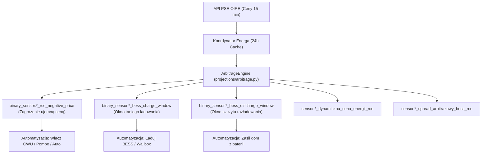

# ⚡ Automatyzacje Cen Dynamicznych PSE RCE i Arbitrażu BESS

> **Kompleksowy poradnik konfiguracji automatyzacji Home Assistant dla taryf dynamicznych, ochrony przed ujemnymi cenami energii oraz arbitrażu bateryjnego i sterowania odbiornikami dużej mocy.**

---

## 📑 Spis Treści
1. [Wprowadzenie i Architektura Arbitrażu](#1-wprowadzenie-i-architektura-arbitrażu)
2. [Encje Decyzyjne Integracji](#2-encje-decyzyjne-integracji)
3. [Gotowe Szablony Automatyzacji (Blueprints)](#3-gotowe-szablony-automatyzacji-blueprints)
   - [A. Ochrona przed Ujemnymi Cenami RCE (Load Boost / Curtailment)](#a-ochrona-przed-ujemnymi-cenami-rce)
   - [B. Inteligentne Ładowanie Magazynu BESS / Auta EV (Tani Prąd)](#b-inteligentne-ładowanie-magazynu-bess--auta-ev)
   - [C. Rozładowanie Magazynu BESS w Szczycie Cenowym RCE](#c-rozładowanie-magazynu-bess-w-szczycie-cenowym-rce)
4. [Scenariusze Praktyczne (Agrestowa 4)](#4-scenariusze-praktyczne-agrestowa-4)
   - [Scenariusz 1: Grzanie CWU i Boost Pompy Ciepła przy RCE < 0](#scenariusz-1-grzanie-cwu-i-boost-pompy-ciepła-przy-rce--0)
   - [Scenariusz 2: Ładowanie Samochodu Elektrycznego (np. BMW) w Dołku Cenowym](#scenariusz-2-ładowanie-samochodu-elektrycznego-np-bmw-w-dołku-cenowym)
   - [Scenariusz 3: Dynamiczne Ograniczenie Eksportu PV (Curtailment)](#scenariusz-3-dynamiczne-ograniczenie-eksportu-pv-curtailment)

---

## 🏗️ 1. Wprowadzenie i Architektura Arbitrażu

Od lipca 2024 r. prosumenci w systemie net-billingu mogą korzystać z rozliczeń w oparciu o rynkową cenę energii (RCE) w interwałach 15-minutowych publikowanych przez **Polskie Sieci Elektroenergetyczne (PSE OIRE)**.

W słoneczne dni (szczególnie w weekendy o niskim zapotrzebowaniu krajowym) ceny na rynku bilansującym potrafią spaść **poniżej zera (RCE < 0 zł/kWh)**. Oznacza to, że niekontrolowany eksport energii do sieci w tych godzinach generuje stratę na koncie depozytu prosumenckiego.

Integracja Energa My Meter PRO posiada wbudowany silnik **`ArbitrageEngine`** ([`projections/arbitrage.py`](../custom_components/energa_mobile/projections/arbitrage.py)), który:
1. Pobiera bezpośrednio z PSE oficjalne interwały cenowe na bieżącą oraz kolejną dobę (Day-Ahead).
2. Wykrywa wszystkie okresy cen ujemnych (`RCE < 0 PLN/kWh`).
3. Uwzględnia sprawność cyklu magazynu energii (Round-Trip Efficiency, domyślnie 88%) oraz minimalny opłacalny spread cenowy (domyślnie 0.05 PLN/kWh).
4. Automatycznie wyznacza optymalne okna ładowania (`CHARGE`) i rozładowania (`DISCHARGE`).



---

## 📡 2. Encje Decyzyjne Integracji

Dla każdego licznika z taryfą dynamiczną / net-billingiem integracja automatycznie tworzy dedykowane sensory binarne i pomiarowe:

| Encja | Nazwa w HA | Typ | Opis |
| :--- | :--- | :--- | :--- |
| `binary_sensor.licznik_<serial>_cena_ujemna_rce_zagrozenie_eksportu` | **Cena ujemna RCE (Zagrożenie eksportu)** | `problem` | Włącza się (`on`), gdy cena energii jest ujemna (< 0 zł). |
| `binary_sensor.licznik_<serial>_okno_ladowania_bess_arbitraz_rce` | **Okno ładowania BESS (Arbitraż RCE)** | `battery_charging` | Włącza się (`on`) w godzinach najniższych cen RCE w ciągu doby. |
| `binary_sensor.licznik_<serial>_okno_rozladowania_bess_szczyt_rce` | **Okno rozładowania BESS (Szczyt RCE)** | `battery` | Włącza się (`on`) w godzinach najwyższych stawek RCE (szczyt wieczorny). |
| `sensor.licznik_<serial>_dynamiczna_cena_energii_rce` | **Bieżąca cena dynamiczna RCE** | `monetary` | Aktualna stawka 15-minutowa brutto z PSE (PLN/kWh). |
| `sensor.licznik_<serial>_spread_arbitrazowy_bess_rce` | **Spread arbitrażowy BESS (RCE)** | `monetary` | Różnica cenowa po uwzględnieniu 88% sprawności baterii (PLN/kWh). |

---

## 🛠️ 3. Gotowe Szablony Automatyzacji (Blueprints)

W folderze integracji znajdują się gotowe szablony Blueprints, które pojawiają się automatycznie w menu **Ustawienia → Automatyzacje i sceny → Szablony (Blueprints)**:

### A. Ochrona przed Ujemnymi Cenami RCE
* **Plik:** [`custom_components/energa_mobile/blueprints/automation/energa_mobile/energa_rce_negative_price_protection.yaml`](../custom_components/energa_mobile/blueprints/automation/energa_mobile/energa_rce_negative_price_protection.yaml)
* **Działanie:**
  - Gdy cena spada poniżej zera: wysyła powiadomienie push z aktualną stawką i uruchamia akcje podnoszące autokonsumpcję (np. dogrzewanie zasobnika CWU, klimatyzacja).
  - Po zakończeniu okna ujemnego: przywraca stan poprzedni.

### B. Inteligentne Ładowanie Magazynu BESS / Auta EV
* **Plik:** [`custom_components/energa_mobile/blueprints/automation/energa_mobile/energa_bess_arbitrage_charging.yaml`](../custom_components/energa_mobile/blueprints/automation/energa_mobile/energa_bess_arbitrage_charging.yaml)
* **Działanie:**
  - Gdy rozpoczyna się optymalne okno najniższych cen: włącza ładowanie magazynu z sieci lub startuje ładowarkę wallbox.
  - Wyłącza ładowanie natychmiast po zakończeniu okna opłacalnego spreadu.

### C. Rozładowanie Magazynu BESS w Szczycie Cenowym RCE
* **Plik:** [`custom_components/energa_mobile/blueprints/automation/energa_mobile/energa_bess_peak_discharge.yaml`](../custom_components/energa_mobile/blueprints/automation/energa_mobile/energa_bess_peak_discharge.yaml)
* **Działanie:**
  - Aktywuje oddawanie energii z magazynu lub tryb maksymalnego samowystarczalnego zasilania domu w najdroższych godzinach szczytowych.

---

## 💡 4. Scenariusze Praktyczne (Agrestowa 4)

### Scenariusz 1: Grzanie CWU i Boost Pompy Ciepła przy RCE < 0
W momencie wystąpienia ujemnej ceny energii, automatyzacja zwiększa zadaną temperaturę w zasobniku CWU lub włącza grzałkę elektryczną:

```yaml
alias: "Agrestowa 4: Ochrona przed ujemną ceną RCE (CWU Boost)"
trigger:
  - platform: state
    entity_id: binary_sensor.licznik_11685328_cena_ujemna_rce_zagrozenie_eksportu
    to: "on"
action:
  - service: climate.set_temperature
    target:
      entity_id: climate.pompa_ciepla_agrestowa
    data:
      temperature: 55
  - service: notify.notify
    data:
      title: "⚠️ Ujemna cena energii na Agrestowej!"
      message: "Cena RCE wynosi {{ states('sensor.licznik_11685328_dynamiczna_cena_energii_rce') }} zł. Załączono grzanie CWU na max."
```

### Scenariusz 2: Ładowanie Samochodu Elektrycznego (np. BMW) w Dołku Cenowym
Wykorzystanie okna arbitrażowego do naładowania baterii pojazdu przy najniższej cenie rynkowej:

```yaml
alias: "Agrestowa 4: Ładowanie BMW w oknie arbitrażowym RCE"
trigger:
  - platform: state
    entity_id: binary_sensor.licznik_11685328_okno_ladowania_bess_arbitraz_rce
    to: "on"
action:
  - service: switch.turn_on
    target:
      entity_id: switch.wallbox_bmw_charging
  - service: notify.mobile_app_telefon
    data:
      title: "🚗 Tani prąd dla BMW!"
      message: "Rozpoczęto ładowanie samochodu w najtańszym oknie RCE."
```

### Scenariusz 3: Dynamiczne Ograniczenie Eksportu PV (Curtailment)
W przypadku falowników wspierających ograniczenie eksportu (np. Solis, Huawei, Deye przez SunSpec/Modbus):

```yaml
alias: "Agrestowa 4: Curtailment falownika przy cenie ujemnej"
trigger:
  - platform: state
    entity_id: binary_sensor.licznik_11685328_cena_ujemna_rce_zagrozenie_eksportu
    to: "on"
action:
  - service: number.set_value
    target:
      entity_id: number.solis_export_limit
    data:
      value: 0
```
