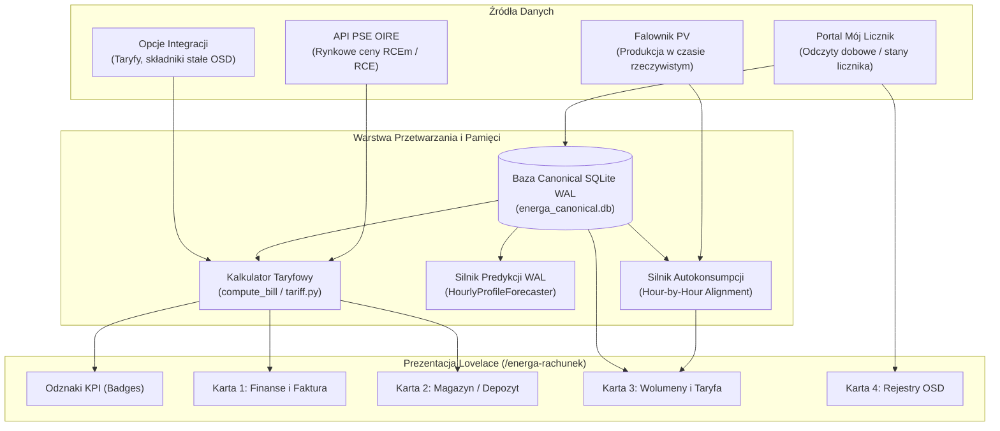

# 📊 Pulpit Lovelace: Centrum Rozliczeń Energa (`/energa-rachunek`)

> **Kompletny przewodnik architektoniczny, encyklopedia encji i matematyczny opis algorytmów rozliczeniowych dla integracji Energa My Meter API PRO.**

---

## 📑 Spis Treści
1. [Architektura i Zasada Działania](#-1-architektura-i-zasada-działania)
2. [Automatyczna Adaptacja do Profilu (Polimorfizm)](#-2-automatyczna-adaptacja-do-profilu-polimorfizm)
3. [Struktura Pulpitu i Układ Kart](#-3-struktura-pulpitu-i-układ-kart)
4. [Szczegółowy Opis Kart i Wzory Matematyczne](#-4-szczegółowy-opis-kart-i-wzory-matematyczne)
   - [Pasek Odznak (Badges)](#a-pasek-odznak-badges)
   - [Karta 1: Rozliczenie Finansowe Energa](#b-karta-1--rozliczenie-finansowe-energa)
   - [Karta 2: Wirtualny Magazyn Energii / Depozyt Prosumencki](#c-karta-2--wirtualny-magazyn-energii--depozyt-prosumencki)
   - [Karta 3: Taryfa, Koszt i Wolumeny Energii](#d-karta-3--taryfa-koszt-i-wolumeny-energii)
   - [Karta 4: Rejestry Licznika Fizycznego OSD](#e-karta-4--rejestry-licznika-fizycznego-osd)
5. [Silnik Predykcji Profilowej WAL (Forecasting Engine)](#-5-silnik-predykcji-profilowej-wal-forecasting-engine)
6. [Studium Przypadku: Weryfikacja co do Grosza z Rzeczywistą Fakturą](#-6-studium-przypadku-weryfikacja-co-do-grosza-z-rzeczywistą-fakturą)
7. [Zarządzanie Pulpitem i Regeneracja](#-7-zarządzanie-pulpitem-i-regeneracja)

---

## 🏗️ 1. Architektura i Zasada Działania

Pulpit `/energa-rachunek` powstaje w pełni autonomicznie w procesie tzw. **Auto-Provisioningu** ([`dashboard_generator.py`](../custom_components/energa_mobile/dashboard_generator.py)).



### Kluczowe zalety rozwiązania:
* **Zero konfiguracji YAML:** Dashboard jest bezpośrednio rejestrowany w rejestrach Home Assistant (`.storage/lovelace_dashboards` oraz `.storage/lovelace.energa_rachunek`).
* **Zawsze aktualny:** Jeśli użytkownik posiada wiele liczników (PPE) na jednym koncie, generator tworzy odrębny, zoptymalizowany widok dla każdego punktu poboru (np. `/energa-rachunek/glowny`, `/energa-rachunek/licznik-12345678`).
* **Bezpieczeństwo sesji:** Nie nadpisuje ani nie koliduje z domyślnym pulpitem użytkownika (`lovelace`).

---

## 🎛️ 2. Automatyczna Adaptacja do Profilu (Polimorfizm)

Generator rozpoznaje typ taryfy i model prosumencki, dynamicznie dobierając układ:

| Parametr / Profil | Net-Billing (Nowy system) | Net-Metering (Stary system 0.8/0.7) | Konsument bez PV |
| :--- | :--- | :--- | :--- |
| **Współczynnik (`coeff`)** | `< 0.7` (domyślnie `0.0`) | `0.8` lub `0.7` | sam pobór (brak PV) |
| **Karta Magazynu** | 💰 Depozyt Prosumencki w PLN | 🔋 Wirtualny Magazyn w kWh (FIFO 12m) | *Karta ukryta* |
| **Wycena Oddania** | RCEm $\times$ 1.23 (PLN/kWh) | Brak (rozliczenie ilościowe kWh) | *Brak* |
| **Strefy Taryfowe** | T1/T2 (G12w) lub Całodobowa (G11) | Izolacja stref L1 (Dzień) i L2 (Noc) | T1/T2 lub Całodobowa |
| **Odznaki Główne** | Rachunek, Prognoza, Depozyt PLN, RCEm | Rachunek, Prognoza, Magazyn kWh, Poziom % | Rachunek, Prognoza, Taryfa |

---

## 📋 3. Struktura Pulpitu i Układ Kart

Wszystkie encje powiązane z danym licznikiem posiadają znormalizowany prefiks z numerem seryjnym w małych literach (np. `sensor.energa_<numer_licznika>_*`).

```text
+-----------------------------------------------------------------------------------+
|  [ BADGES: Dotychczas brutto | Prognoza brutto | Magazyn/Depozyt | Wycena oddania ] |
+-----------------------------------------------------------------------------------+
|  🏡 Karta Nagłówkowa (Markdown: Nazwa punktu | Taryfa | System | Numer licznika)     |
+-----------------------------------------------------------------------------------+
|  ⚡ KARTA 1: Rozliczenie Finansowe Energa (Odtworzenie bieżącej faktury VAT)       |
+-----------------------------------------------------------------------------------+
|  🔋 KARTA 2: Wirtualny Magazyn Energii (Konto depozytu PLN lub Magazyn FIFO kWh)  |
+-----------------------------------------------------------------------------------+
|  ⚡ KARTA 3: Taryfa i Wolumeny Energii (Pobory, Oddania, Ceny kWh, Autokonsumpcja) |
+-----------------------------------------------------------------------------------+
|  🔢 KARTA 4: Rejestry Licznika Fizycznego OSD (1.8.0, 2.8.0, dobowe przyrosty)   |
+-----------------------------------------------------------------------------------+
```

---

## 🔬 4. Szczegółowy Opis Kart i Wzory Matematyczne

---

### A. Pasek Odznak (Badges)

1. **`sensor.energa_{serial}_dotychczasowy_rachunek` (Dotychczas brutto)**
   * **Źródło:** Moduł kalkulacji taryfowej [`tariff.py`](../custom_components/energa_mobile/tariff.py).
   * **Opis:** Kwota faktury brutto do zapłaty od 1. dnia miesiąca do chwili obecnej.
   * **Wzór:**
     $$\text{Rachunek MTD} = \text{Całkowity Koszt Brutto MTD} - \text{Potrącenie z Depozytu}$$

2. **`sensor.energa_{serial}_prognoza_rachunku` (Prognoza brutto)**
   * **Źródło:** Moduł predykcyjny [`forecast.py`](../custom_components/energa_mobile/projections/forecast.py).
   * **Opis:** Estymacja należności na koniec bieżącego miesiąca oparta o profile godzinowe dni roboczych i świąt.

3. **`sensor.energa_{serial}_bank_wirtualny_pln` (Magazyn/Depozyt PLN — Net-billing)**
   * **Źródło:** Moduł bilansujący [`fifo_net_billing.py`](../custom_components/energa_mobile/core/settlement/fifo_net_billing.py).
   * **Opis:** Aktualne dostępne saldo depozytu prosumenckiego po uwzględnieniu potrąceń za energię czynną w bieżącym okresie.

4. **`sensor.energa_{serial}_cena_oddania` (Wycena oddania — Net-billing)**
   * **Źródło:** Sensor cenowy [`EnergaPriceSensor`](../custom_components/energa_mobile/sensor.py).
   * **Wzór:**
     $$\text{Cena Oddania} = \text{RCEm} \times 1{,}23\ \left[\frac{\text{PLN}}{\text{kWh}}\right]$$

5. **`sensor.energa_{serial}_bank_wirtualny_kwh` oraz `..._magazyn_poziom` (Net-metering)**
   * **Źródło:** Moduł FIFO [`fifo_net_metering.py`](../custom_components/energa_mobile/core/settlement/fifo_net_metering.py).
   * **Wzór na poziom magazynu:**
     $$\text{Poziom Magazynu (\%)} = \frac{\text{Aktualne Saldo Banku (kWh)}}{\sum \text{Depozyty z ostatnich 12 miesięcy (kWh)}} \times 100\%$$

---

### B. Karta 1: ⚡ Rozliczenie Finansowe Energa

Odtwarza pełną specyfikację faktury VAT wystawianej wspólnie przez Energa Obrót oraz Energa Operator.

* **`sensor.energa_{serial}_dotychczasowy_rachunek`:**
  Finalna kwota do uregulowania za bieżący miesiąc.
* **`sensor.energa_{serial}_prognoza_rachunku`:**
  Przewidywana kwota faktury końcowej.
* **`sensor.energa_{serial}_koszt_brutto_mtd`:**
  Suma sprzedaży i dystrybucji brutto przed potrąceniem depozytu PV:
  $$\text{Koszt Brutto} = (\text{Sprzedaż Netto} + \text{Dystrybucja Netto}) \times 1{,}23$$
* **`sensor.energa_{serial}_koszt_energii_czynnej_mtd`:**
  Energia czynna brutto zakupiona od sprzedawcy:
  $$\text{Sprzedaż Brutto} = \Big[ (\text{Pobór T1} \times C_{\text{en, T1}}) + (\text{Pobór T2} \times C_{\text{en, T2}}) + \text{Opłata Handlowa} \Big] \times 1{,}23$$
* **`sensor.energa_{serial}_koszt_dystrybucji_mtd`:**
  Usługi dystrybucyjne brutto (Energa Operator). Obejmuje 8 składników taryfowych:
  $$\text{Dystrybucja Brutto} = \Big[ S_{\text{zmienny, T1}} + S_{\text{zmienny, T2}} + O_{\text{jakościowa}} + O_{\text{OZE}} + O_{\text{kogeneracyjna}} + S_{\text{stały sieciowy}} + O_{\text{abonament}} + O_{\text{mocowa}} \Big] \times 1{,}23$$
  > **Uwaga dot. Opłaty Mocowej:** Opłata mocowa jest dobierana automatycznie według urzędowych progów Prezesa URE na rok 2026 na podstawie szacowanego rocznego poboru budynku:
  > * $< 500\text{ kWh/rok} \rightarrow 4{,}29\text{ zł netto}$
  > * $500 - 1200\text{ kWh/rok} \rightarrow 10{,}31\text{ zł netto}$
  > * $1200 - 2800\text{ kWh/rok} \rightarrow 17{,}18\text{ zł netto}$
  > * $> 2800\text{ kWh/rok} \rightarrow 24{,}05\text{ zł netto}$
* **`sensor.energa_{serial}_odzyskano_z_depozytu_mtd`:**
  Zgodnie z art. 4 ust. 11 Ustawy o OZE depozyt prosumencki może pokryć **wyłącznie energię czynną** (nigdy dystrybucję ani opłatę handlową):
  $$\text{Odzyskano z Depozytu} = \min(\text{Dostępny Depozyt PLN},\ \text{Energia Czynna Brutto})$$

---

### C. Karta 2: 🔋 Wirtualny Magazyn Energii / Depozyt Prosumencki

Zapewnia pełną przejrzystość rozliczeń wyprodukowanej energii słonecznej.

#### Wariant Net-billing:
* **`sensor.energa_{serial}_bank_wirtualny_pln`:** Aktualny portfel depozytu.
* **`sensor.energa_{serial}_depozyt_wygenerowany_mtd`:** Wartość doładowania konta depozytowego z nadwyżek wyeksportowanych w tym miesiącu:
  $$\text{Doładowanie} = \text{Eksport MTD (kWh)} \times \text{RCEm} \times 1{,}23$$
* **`sensor.energa_{serial}_rcem_auto`:** Rynkowa miesięczna cena energii publikowana przez PSE.
* **`sensor.energa_{serial}_cena_oddania`:** Stawka zasilenia depozytu brutto ($\text{RCEm} \times 1{,}23$).

#### Wariant Net-metering (Opusty):
* **`sensor.energa_{serial}_bank_wirtualny_kwh`:** Łączna energia do odebrania z sieci.
* **`sensor.energa_{serial}_bank_wirtualny_l1_dzien_kwh` / `_l2_noc_kwh`:**
  Precyzyjnie rozdzielone strefy magazynu. Zgodnie z zasadami OSD w taryfach wielostrefowych magazyn dzienny (L1) kompensuje wyłącznie zużycie dzienne, a nocny (L2) wyłącznie nocne i weekendowe.
* **`sensor.energa_{serial}_pokrycie_z_magazynu_dzien_mtd` / `_noc_mtd`:**
  Wolumen odebrany z wirtualnego magazynu w danym miesiącu (zwolniony z opłaty za energię czynną i zmiennej sieciowej).

---

### D. Karta 3: ⚡ Taryfa, Koszt i Wolumeny Energii

* **`sensor.energa_{serial}_cena_poboru_strefa_1` / `_strefa_2`:**
  Kompletna, zmienna cena zakupu 1 kWh z sieci brutto (energia czynna + zmienne dystrybucyjne + podatki). Pozwala ocenić faktyczny koszt uruchomienia urządzeń w poszczególnych godzinach.
* **`sensor.energa_{serial}_pobor_energii_strefa_1_mtd` / `_strefa_2_mtd`:**
  Ilość energii pobranej z sieci w strefie szczytowej (T1) i pozaszczytowej (T2).
* **`sensor.energa_{serial}_oddanie_energii_strefa_1_mtd` / `_strefa_2_mtd`:**
  Wolumen energii słonecznej oddanej do sieci w poszczególnych strefach.
* **`sensor.energa_{serial}_autokonsumpcja_mtd`:**
  Ilość energii z instalacji PV skonsumowana bezpośrednio w budynku bez przesyłania przez licznik OSD (wyliczona przez moduł asynchronicznej synchronizacji godzinowej).
* **`sensor.energa_{serial}_stopien_autokonsumpcji_mtd`:**
  Procentowy udział energii zużytej na miejscu w całkowitej produkcji instalacji fotowoltaicznej:
  $$\text{Stopień autokonsumpcji} = \frac{\text{Autokonsumpcja MTD}}{\text{Produkcja Falownika MTD}} \times 100\%$$

---

### E. Karta 4: 🔢 Rejestry Licznika Fizycznego OSD

* **`sensor.energa_{serial}_stan_licznika_import`:** Wskazanie całkowite licznika poboru (rejestr OBIS **1.8.0**).
* **`sensor.energa_{serial}_stan_licznika_export`:** Wskazanie całkowite licznika oddania (rejestr OBIS **2.8.0**).
* **`sensor.energa_{serial}_zuzycie_dzis` / `_produkcja_dzis`:** Przyrost dobowy z ostatniej zamkniętej doby z portalu Mój Licznik.
* **`sensor.energa_{serial}_ppe`:** Unikalny numer logicznego Punktu Poboru Energii (PPE).

---

## 🧠 5. Silnik Predykcji Profilowej WAL (Forecasting Engine)

Prognoza rachunku w integracji Energa PRO nie jest prostym mnożeniem średniej arytmetycznej. Wykorzystuje zaawansowany silnik [`HourlyProfileForecaster`](../custom_components/energa_mobile/projections/forecast.py):

1. **Dekonstrukcja profilu (24 koszyki godzinowe):**
   Algorytm dzieli historię z bazy Canonical SQLite WAL na dwa niezależne profile:
   * **Profil Dni Roboczych (Weekday):** od poniedziałku do piątku (z wyłączeniem świąt).
   * **Profil Weekendowo-Świąteczny (Weekend/Holiday):** soboty, niedziele oraz wszystkie ustawowe dni wolne od pracy w Polsce.
2. **Polski kalendarz świąt ustawowych:**
   Obsługuje święta stałe oraz ruchome (Wielkanoc, Poniedziałek Wielkanocny, Boże Ciało, Zielone Świątki) wyznaczane astronomicznym algorytmem Meeusa/Jonesa/Butchera.
3. **Kwalifikacja strefowa (G12w):**
   Dla każdej przyszłej godziny w miesiącu silnik precyzyjnie przypisuje strefę T1 (szczyt) lub T2 (pozaszczyt/weekend/święto).
4. **Filtr wygładzający (`smoothed_blend_7d`):**
   W dniach 1–6 każdego miesiąca stosowane jest dynamiczne ważenie danych bieżących ze średnią roczną, co eliminuje anomalie predykcyjne na początku okresu.

---

## 📊 6. Studium Przypadku: Weryfikacja co do Grosza z Rzeczywistą Fakturą

Poniższa tabela przedstawia porównanie wskazań pulpitu Lovelace z oficjalną, zweryfikowaną fakturą Energa Obrót za lipiec dla modelowego punktu poboru w taryfie G12w (Net-billing, instalacja fotowoltaiczna):

| Pozycja Rozliczeniowa | Wskazanie na Papierowej Fakturze | Obliczenie Dashboardu HA | Zgodność |
| :--- | :---: | :---: | :---: |
| **Pobór zbilansowany T1** | 164 kWh | 164 kWh | 100% |
| **Pobór zbilansowany T2** | 237 kWh | 237 kWh | 100% |
| **Oddanie zbilansowane do sieci** | 456 kWh | 456 kWh | 100% |
| **Sprzedaż energii czynnej brutto** | 239,92 zł | 239,92 zł | **Co do grosza** |
| **Usługi dystrybucji brutto** | 182,60 zł | 182,60 zł | **Co do grosza** |
| **Koszt całkowity brutto (przed depozytem)** | 422,52 zł | 422,52 zł | 100% |
| **Zasilono depozyt (456 kWh $\times$ 0,26288 $\times$ 1,23)** | 147,44 zł | 147,44 zł | **Co do grosza** |
| **Potrącenie z depozytu na energię czynną** | -147,44 zł | -147,44 zł | 100% |
| **Należność bieżąca faktury** | **275,08 zł** | **275,08 zł** | **100%** |
| *Odsetki ustawowe za zwłokę (nota)* | *+0,08 zł* | — *(poza taryfą)* | — |
| **Faktyczna kwota przelewu** | **275,16 zł** | **275,08 zł** | **Różnica 8 gr (odsetki)** |

---

## 🛠️ 7. Zarządzanie Pulpitem i Regeneracja

### Ponowne wygenerowanie pulpitu
Jeśli przypadkowo zmodyfikujesz lub usuniesz karty na pulpicie, możesz go przywrócić w dowolnym momencie:
* Przejdź do: **Ustawienia** → **Urządzenia oraz usługi** → **Energa My Meter PRO** → Twoje urządzenie.
* W sekcji **Elementy sterujące** kliknij:
  👉 **`Utwórz Pulpit Rozliczeń`** (`button.energa_{serial}_utworz_pulpit_rozliczen`).
* Możesz także wywołać akcję w Narzędziach Deweloperskich:
  ```yaml
  action: energa_mobile.generate_dashboard
  ```

### Aktualizacja stawek taryfowych
Wszystkie stawki bazowe (cena T1/T2, opłaty sieciowe, opłata handlowa) można zaktualizować w:
**Ustawienia** → **Urządzenia oraz usługi** → **Energa My Meter PRO** → **Konfiguruj** → **Ceny energii i taryfy**.
Zmiany są aplikowane natychmiast bez konieczności restartu Home Assistanta.
